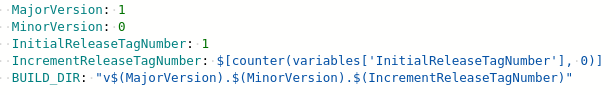
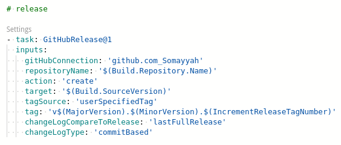
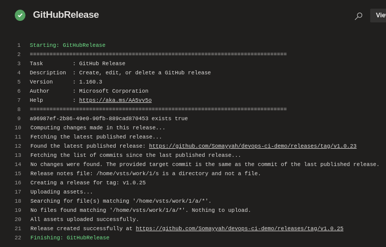
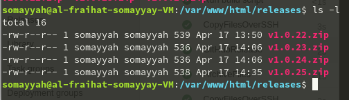
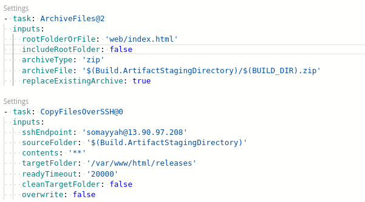
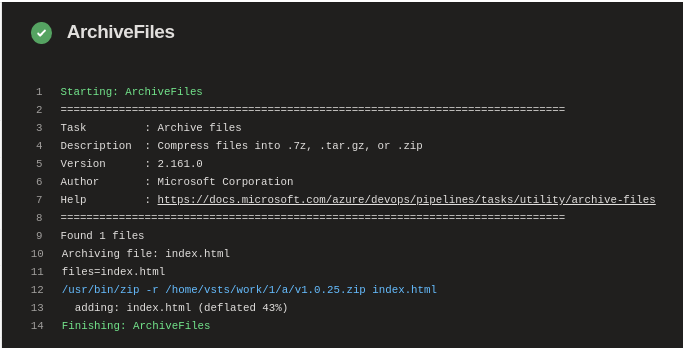

# Task 1: Release and Archiving Process, Using Github and Azure Pipelines

- [x] Creating an automaticly named release tag on Azure Pipelines
- [x] Deploying the releases using Azure Pipelines on Github.
- [x] Archiving every successfull releases on the Virtual machine

---------------------------------------------------------------------------
### Releases Tag created using Azure Pipelines:

### Releases deployed on github:
[link ](https://github.com/Somayyah/devops-ci-demo/releases)

#### Console data:

### Archived 

#### Console data:

